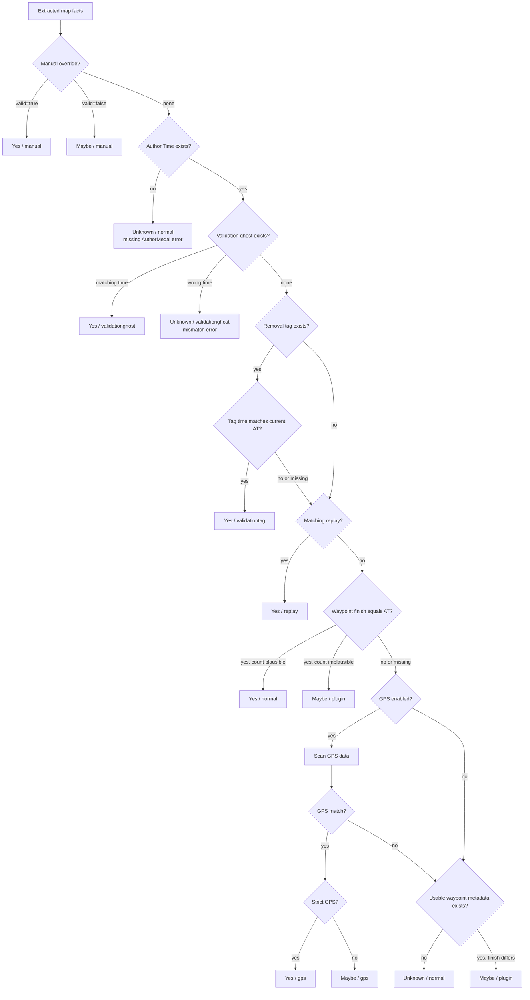

# Map Validation Checker

A CLI tool that inspects Trackmania `.Map.Gbx` files and reports how their Author Times appear to have been validated.

Don't want to run or build the executable? Use the [web version](https://tools.xjk.yt/Map-Validation-Checker/) instead.

## Features

- Single-map and batch-folder processing
- Optional replay matching and UID-based manual overrides
- Validation ghost, removal-tag, waypoint metadata, and GPS evidence
- JSON output to stdout and, optionally, a file
- Recursive scanning and progress reports with rate and ETA
- Diagnostic `--data-dump` output for inspecting parsed GBX internals

## Usage

```powershell
MapValidationChecker --single "C:\Maps\MyMap.Map.Gbx"
MapValidationChecker --batch "C:\Maps" --recursive --pretty
MapValidationChecker --batch "C:\Maps" --replays "C:\Replays"
```

### Options

| Option | Purpose |
|---|---|
| `--replays <path>` | Match replay UID and ghost time against the map |
| `--manual <file>` | Apply UID-based manual overrides |
| `--recursive` | Include subfolders in batch and replay scans |
| `--pretty` | Pretty-print the JSON result |
| `--include-path` | Include map and matching replay paths |
| `--no-map-name` | Omit `mapName` from the result |
| `--progress` | Write scan counts, rates, and ETA to stderr |
| `--progress-interval <sec>` | Set the progress update interval; default is 5 seconds |
| `--output <file>` | Write the JSON result to a file as well as stdout |
| `--no-gps` | Disable GPS evidence |
| `--strict-gps` | Treat a GPS match as `Yes` instead of `Maybe` |
| `--gps-threshold-ms <ms>` | Set the GPS fallback tolerance; default is 100 ms |
| `--data-dump` | Include parsed diagnostic details |
| `--max-depth <n>` | Limit diagnostic reflection traversal depth |
| `--help` | Show the complete usage text |

### Manual overrides

The file may contain one object or an array. `note` is optional.

```json
[
  { "uid": "ABC123", "valid": true, "note": "Reviewed manually" },
  { "uid": "DEF456", "valid": false, "note": "Keep flagged" }
]
```

`valid: true` produces `Yes / manual`; `valid: false` produces `Maybe / manual`. The loader also accepts accidental `True` and `False` casing.

## What it checks



Results use `Yes`, `Maybe`, or `Unknown`, together with a type such as `normal`, `plugin`, `gps`, or `replay`.

### Evidence notes

- A validation ghost must exactly match the current Author Time. A mismatching embedded ghost produces an error.
- A removal tag validates only when its stored Author Time matches the current one. Stale tags and tags without a time continue to replay, waypoint, and GPS checks.
- Replay evidence requires both a matching map UID and an exact matching ghost time.
- Normal validation requires `Race_AuthorRaceWaypointTimes` to end at the Author Time with a plausible waypoint count. Lap races and invalid linked-checkpoint groups receive their expected count adjustments.
- GPS checks exact media-block `U05` values first, then `U03` and countdown-normalized `U03 - 3000` values within the configured threshold.
- GPS evidence is `Maybe` by default because it is supporting evidence; `--strict-gps` promotes a match to `Yes`.

## Output

Single mode writes one JSON object; batch mode writes an array containing one report per scanned file. Non-GBX and unparseable files become error reports rather than stopping a batch.

```json
{
  "uid": "abcd...",
  "validated": "Yes",
  "type": "normal",
  "note": null,
  "gpsValidation": null,
  "path": null,
  "mapName": "Example Map",
  "replayPath": null,
  "error": null,
  "dataDump": null
}
```

| Field | Description |
|---|---|
| `uid` | Map UID, when available |
| `validated` | `Yes`, `Maybe`, or `Unknown` |
| `type` | Winning evidence type: `normal`, `plugin`, `validationghost`, `validationtag`, `gps`, `replay`, or `manual` |
| `note` | Optional explanation or warning |
| `gpsValidation` | GPS method, matched time, delta, threshold, and source |
| `path` | Map path when `--include-path` is enabled |
| `mapName` | Map name unless `--no-map-name` is enabled |
| `replayPath` | Matching replay path when paths are included |
| `error` | Per-file validation or parsing error |
| `dataDump` | Raw diagnostic details when `--data-dump` is enabled |

## Build

Requires the .NET 10 SDK.

```powershell
dotnet build .\MapValidationChecker.sln -c Release
dotnet test .\MapValidationChecker.sln -c Release
dotnet run --project .\src\MapValidationChecker.Cli -- --help
```

### Publish a self-contained Windows executable

```powershell
dotnet publish .\src\MapValidationChecker.Cli\MapValidationChecker.Cli.csproj `
  -c Release -r win-x64 --self-contained true `
  -p:PublishSingleFile=true `
  -p:IncludeNativeLibrariesForSelfExtract=true `
  -p:PublishTrimmed=false `
  -p:EnableCompressionInSingleFile=true
```

The executable is written to:

```text
src/MapValidationChecker.Cli/bin/Release/net10.0/win-x64/publish/MapValidationChecker.exe
```

## Limitations

- The result describes available evidence; it cannot guarantee that an Author Time is legitimate.
- Matching metadata or a replay may originate from a different version of a map.
- GPS ghosts may exist for guides, cut fixes, or other reasons unrelated to validation.
- Manual overrides are trusted input and take priority over every automatic check.
