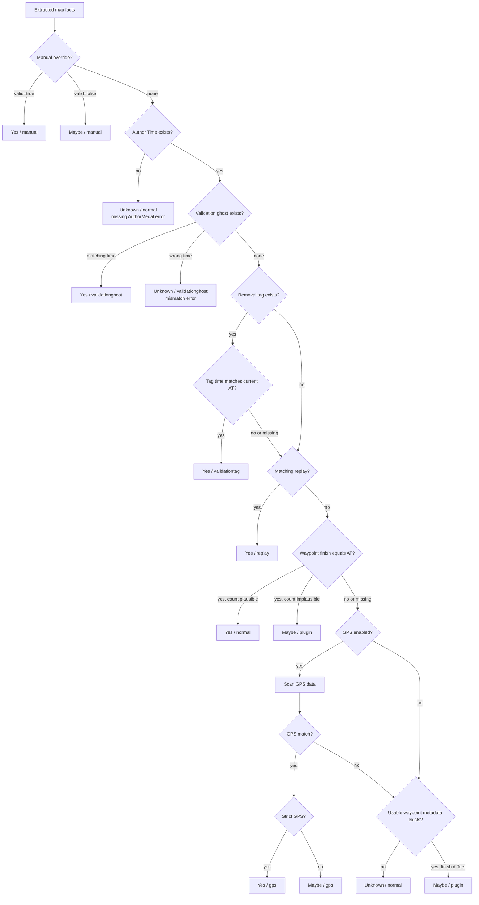

# Map Validation Checker

A CLI tool that inspects Trackmania `.Map.Gbx` files and reports how their Author Times appear to have been validated.

Don't want to run or build the executable? Use the [web version](https://tools.xjk.yt/Map-Validation-Checker/) instead.

## Usage

```powershell
MapValidationChecker --single "C:\Maps\MyMap.Map.Gbx"
MapValidationChecker --batch "C:\Maps" --recursive --pretty
MapValidationChecker --batch "C:\Maps" --replays "C:\Replays"
```

Useful options:

- `--manual <file>` — apply UID-based manual overrides
- `--no-gps` — disable GPS evidence
- `--strict-gps` — treat a GPS match as `Yes` instead of `Maybe`
- `--include-path` — include map and matching replay paths
- `--data-dump` — include parsed diagnostic details
- `--output <file>` — write the JSON result to a file
- `--help` — show every option

Manual override files may contain one object or an array:

```json
{ "uid": "SOME_MAP_UID", "valid": true, "note": "Reviewed manually" }
```

The CLI writes one JSON object in single mode and an array in batch mode.

## What it checks



Results use `Yes`, `Maybe`, or `Unknown`, together with a type such as `normal`, `plugin`, `gps`, or `replay`.

## Build

Requires the .NET 10 SDK.

```powershell
dotnet build .\MapValidationChecker.sln -c Release
dotnet test .\MapValidationChecker.sln -c Release
dotnet run --project .\src\MapValidationChecker.Cli -- --help
```

## Disclaimer

This tool provides supporting evidence; it cannot _guarantee_ that an Author Time is legitimate.
